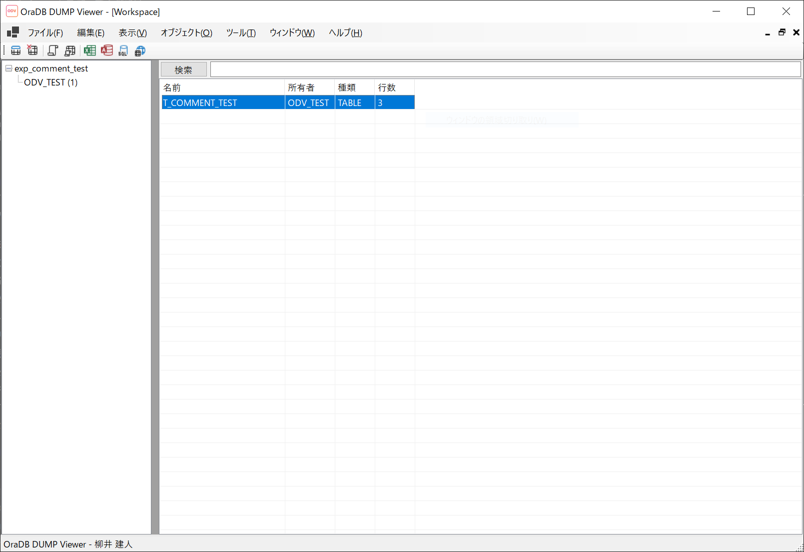

<p align="center">
  
</p>
<h1 align="center">OraDB DUMP Viewer</h1>
<p align="center">
  View Oracle .dmp files <strong>without Oracle</strong> — a Windows desktop tool for EXP &amp; EXPDP dumps<br>
  Oracle 環境なしで .dmp ファイルを解析・閲覧できる Windows デスクトップツール
</p>

<p align="center">
  <a href="https://github.com/OraDB-DUMP-Viewer/OraDB-DUMP-Viewer/releases"></a>
  <a href="https://github.com/OraDB-DUMP-Viewer/OraDB-DUMP-Viewer/releases"></a>
  
  
  
  <a href="https://www.odv.dev/"></a>
</p>

<p align="center">
  <a href="https://www.odv.dev/">Website</a> · <a href="https://www.odv.dev/ja/blog">Blog</a> · <a href="https://github.com/OraDB-DUMP-Viewer/OraDB-DUMP-Viewer/releases/latest">Download</a> · <a href="https://www.odv.dev/ja/register">Get License</a>
</p>

---

<!-- 🖼️ Screenshot: メイン画面（スキーマツリー + テーブルプレビュー）-->
<!-- <p align="center"></p> -->

## Why OraDB DUMP Viewer?

Oracle の .dmp ファイルを開くには、従来は Oracle Database や Client のインストールが必要でした。OraDB DUMP Viewer は **Oracle 環境を一切必要とせず**、.dmp ファイルの中身を GUI で閲覧・エクスポートできます。

| | impdp (Oracle) | OraDB DUMP Viewer | strings コマンド |
|---|:---:|:---:|:---:|
| Oracle 環境 | 必要 | **不要** | 不要 |
| テーブルデータ閲覧 | ✗ | **✓** | ✗ |
| GUI | ✗ | **✓** | ✗ |
| CSV / Excel / SQL エクスポート | ✗ | **✓** | ✗ |
| EXP 形式対応 | ✗ | **✓** | △ |
| 費用 | Oracle ライセンス | **個人無料** | 無料 |

---

## Features / 機能一覧

<table>
<tr>
<td width="50%">

### 🔍 解析・閲覧
- **EXP / EXPDP** 両形式に対応（Oracle 7〜23ai）
- スキーマ → テーブルの階層ツリー表示
- 数百万行のテーブルもページング付きで快適閲覧
- **12 種類の演算子** × AND/OR 複合条件検索
- パーティションテーブルの構造・個別データ表示
- BLOB/CLOB のプレビューとファイル抽出
- C ネイティブ DLL による高速パーサー

</td>
<td width="50%">

### 📤 エクスポート
- **CSV** (RFC 4180 準拠) — 単一 / バッチ
- **SQL** — Oracle / PostgreSQL / MySQL / SQL Server 構文
- **Excel** (.xlsx)
- **Access** (.accdb)
- **SQL Server** 直接インポート
- **ODBC** 経由で任意のデータベースへ
- **LOB 抽出** — BLOB/CLOB を個別ファイルに保存

</td>
</tr>
<tr>
<td>

### 💼 ワークスペース
- 作業状態の保存・復元 (.odvw)
- テーブルの除外 / Undo / Redo
- ドラッグ＆ドロップ / ファイル関連付け
- MRU (最近使ったファイル) リスト
- MDI マルチウィンドウ

</td>
<td>

### 🌍 多言語・その他
- **10 言語**: 日本語・English・中文・한국어・Deutsch・Français・Español・Italiano・Русский・Português
- CHECK 制約・INDEX 定義のエクスポート
- テーブル / カラムコメント対応
- 文字セット自動判定 (UTF-8 / Shift_JIS / EUC-JP)
- 進捗率・残り時間のリアルタイム表示

</td>
</tr>
</table>

---

## Quick Start / クイックスタート

### Install / インストール

**winget (推奨):**
```
winget install OraDBDumpViewer.OraDBDumpViewer
```

**手動ダウンロード:** [GitHub Releases](https://github.com/OraDB-DUMP-Viewer/OraDB-DUMP-Viewer/releases/latest) から MSI インストーラーまたは ZIP ポータブル版をダウンロード

| 形式 | 説明 |
|---|---|
| `*_installer_{arch}.exe` | ショートカット・ファイル関連付け (.dmp) 付き |
| `*_portable_{arch}.zip` | 解凍してすぐ使える。レジストリ変更なし |

### Use / 使い方

```
1. ライセンスを取得  →  https://www.odv.dev/  (個人・教育は無料)
2. アプリを起動  →  ライセンスファイル (.lic.json) で認証
3. .dmp ファイルを開く  →  ドラッグ＆ドロップ or ファイル → 開く
4. テーブルを選択  →  データ閲覧 / 検索 / エクスポート
```

> **v3.1 以降**: ライセンスなしでも**試用版モード**で基本機能（閲覧・検索）を利用可能。エクスポート等はライセンス認証後に解放。

---

## Use Cases / 活用シーン

| シーン | 説明 |
|---|---|
| 📋 **受領データの検証** | 他社から受け取った .dmp ファイルの中身をすぐに確認 |
| 🔄 **Oracle → 他 DB への移行** | PostgreSQL / MySQL / SQL Server 用の SQL を直接生成 |
| 💾 **旧システムのデータ救出** | Oracle ライセンスが切れた環境のデータを CSV / Excel で取り出し |
| 🖼️ **LOB データの回収** | BLOB に格納された画像・PDF をファイルとして抽出 |
| 🔍 **移行前の事前調査** | テーブル構造・データ量・データ型をインポートせずに把握 |

---

## Pricing / 料金

> **個人・教育機関は無料**。すべてのプランで**機能制限なし**。

| Plan | Price | Price (USD) | For |
|---|---|---|---|
| **Personal** | **無料** | **Free** | 個人・学生 |
| **Education** | **無料** | **Free** | 教育・研究機関 |
| **Professional** | ¥4,900/年 | $32/year | フリーランス・個人事業主・NPO |
| **Business** | ¥9,800/年 | $65/year | 法人・企業・チーム |

**[→ ライセンスを取得する](https://www.odv.dev/ja/register)** / **[→ Get your license](https://www.odv.dev/en/register)**

---

## System Requirements / 動作環境

| Item | Requirement |
|---|---|
| OS | Windows 10+ (x64 / ARM64) |
| Runtime | 不要 (.NET ランタイム同梱済み) |
| Supported Files | Oracle .dmp (EXP: Oracle 7–11g / EXPDP: Oracle 10g–23ai) |
| Oracle | **不要 (Not required)** |

---

## Supported Data Types / 対応データ型

| Category | Types |
|---|---|
| Numeric | `NUMBER`, `BINARY_FLOAT`, `BINARY_DOUBLE` |
| String | `VARCHAR2`, `CHAR`, `CLOB`, `NCLOB` |
| Date/Time | `DATE`, `TIMESTAMP` |
| Binary | `BLOB` |

---

## Blog / 技術記事

Oracle ダンプファイルの活用に関する技術記事を公開しています。

- [Oracle 環境なしで DMP ファイルを開く方法](https://www.odv.dev/ja/blog/view-oracle-dmp-without-oracle)
- [DataPump ダンプファイルの中身を確認する 3 つの方法](https://www.odv.dev/ja/blog/inspect-datapump-dump-contents)
- [Oracle ダンプを CSV・Excel に変換する手順](https://www.odv.dev/ja/blog/convert-oracle-dump-to-csv-excel)
- [EXP と EXPDP (Data Pump) の違いと見分け方](https://www.odv.dev/ja/blog/exp-vs-expdp-difference)
- [Oracle ダンプから PostgreSQL へ移行する手順](https://www.odv.dev/ja/blog/migrate-oracle-dump-to-postgresql)
- [Oracle ダンプを SQL Server にインポートする方法](https://www.odv.dev/ja/blog/import-oracle-dump-to-sql-server)
- [Oracle ダンプから BLOB/CLOB を抽出する方法](https://www.odv.dev/ja/blog/extract-blob-clob-from-oracle-dump)
- [Oracle ダンプファイルの破損を確認する方法](https://www.odv.dev/ja/blog/validate-oracle-dump-file)
- [Oracle DBA 向け Windows 必携ツール 5 選](https://www.odv.dev/ja/blog/oracle-dba-essential-windows-tools)

**[→ ブログを見る](https://www.odv.dev/ja/blog)** / **[→ Read the blog (EN)](https://www.odv.dev/en/blog)**

---

## Build from Source / ソースコードからのビルド

### Prerequisites

| Tool | Version |
|---|---|
| Visual Studio | 2026 (MSVC C++ toolchain required) |
| .NET SDK | 10.0 |

### Build

```bash
# 1. Build the C native DLL
cd Logics/DumpParser
build_dll.bat

# 2. Build the VB.NET application
cd ../..
dotnet build "OraDB DUMP Viewer.vbproj"
```

---

## License & Terms / ライセンス・利用条件

### ソフトウェアの利用

| 条件 | 内容 |
|---|---|
| 利用条件 | 有効なライセンスが必要 ([取得はこちら](https://www.odv.dev/)) |
| 利用範囲 | ライセンス取得者本人 (または取得法人) のみ |
| 譲渡・再配布 | 禁止 |

### ソースコードの取り扱い

本リポジトリのソースコードは **参照目的** で公開されています。

| 利用形態 | 可否 |
|---|---|
| 閲覧・学習 | ✓ |
| Pull Request による貢献 | ✓ ([CLA](CLA.md) への署名が必要) |
| 改変して再配布 | ✗ |
| 類似の商用製品の作成 | ✗ |

### 関連ドキュメント

- [EULA](EULA.md) — エンドユーザー使用許諾契約書
- [CLA](CLA.md) — コントリビューターライセンス同意書
- [SECURITY](SECURITY.md) — 脆弱性報告
- [CHANGELOG](CHANGELOG.md) — 更新履歴
- [利用規約・プライバシーポリシー](https://www.ta-yan.ai/rules)

### 免責事項

本ソフトウェアは「現状のまま」提供され、明示または黙示の保証はありません。使用によって生じた損害について開発者は一切の責任を負いません。Oracle、Oracle DataPump は Oracle Corporation の商標です。

---

<p align="center">
  <strong>OraDB DUMP Viewer</strong> — by <a href="https://www.ta-yan.ai/">YANAI Taketo</a><br>
  <a href="https://www.odv.dev/">https://www.odv.dev/</a>
</p>